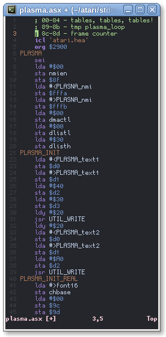

VIM Syntax Highlighting for MADS
================================

Installation
------------
* Manually: put folders `syntax`, `ftplugin` and `ftdetect` in your Vim configs directory:
    * Windows: `%USERPROFILE%\vimfiles`
    * Rest of world: `~/.vim`
* Using [Pathogen](https://github.com/tpope/vim-pathogen/)
    * `git clone https://github.com/skrzyp/vim-mads ~/.vim/bundle/vim-mads`
* Using [VAM](https://github.com/MarcWeber/vim-addon-manager#recommended-setup)
    * Add to vimrc:
        * `autocmd FileType mads VAMActivate github:skrzyp/vim-mads`
* **Recommended**: Using [vim-plug](https://github.com/junegunn/vim-plug)
    * Add to vimrc:
        * `Plug 'acejacek/vim-mads'`

Screenshot
----------

Links
-----

* [MADS](http://mads.atari8.info)
* [atari.area thread](http://www.atari.org.pl/forum/viewtopic.php?id=13407)
